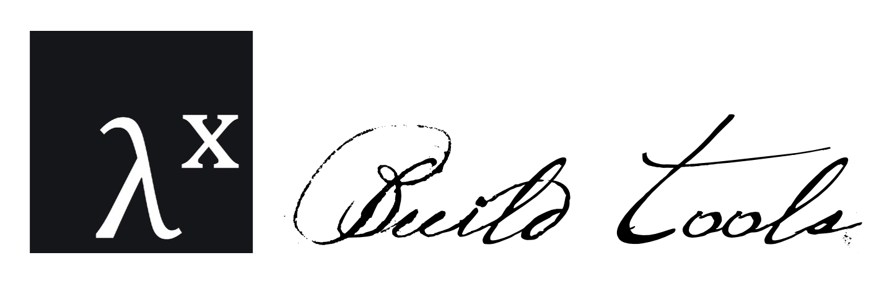

<h3>
  
</h3>

# build-tools

`@fp-tx/build-tools` is a thin wrapper around `tsup` for the purpose of building dual ESM/CJS packages. It contains a chief export `makeConfig` which will read from a configurable source directory and determine which files to include as entrypoints. Using these entrypoints, it also adds dynamic "exports" field with `types`, `import`, and `default` fields based on the determined entrypoints.

To install dependencies:

```bash
bun install
```

To run:

```bash
bun run index.ts
```

This project was created using `bun init` in bun v1.0.7. [Bun](https://bun.sh) is a fast all-in-one JavaScript runtime.
